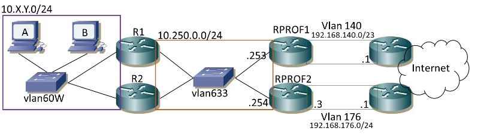

# TP - Mini-Projet supervision

## Table des matières

\[TOC\]

## Introduction

Le repository du projet est trouvable en cliquant sur \[ce lien\](<https://github.com/Marc-Harony/23-813-BROISIN-ARAKHSIS>)

## Partie I : mise en place d'une maquette de réseau local avec haute disponibilité

### Schéma du réseau : 

### Étude théorique préparatoire

#### Question 1

Théoriquement, 32 routes via OSPF car 2 x 16 routes vers les réseau interne de nos collègue (il y a 16 binômes et 2 routeurs/binômes), deux routes directement connectées 10.250.0.0/24 (externe) et 10.200.1.0/24 (interne) et une route pour le management (192.168.170.0/23), soit un total de **36 routes**.

##### Table de routage R1

| Réseau de destination | Prochain saut | Coût |
|-----------------------|:-------------:|-----:|
| 10\.200.1.0/24 | Directement connectée | \* |
| 10\.250.0.0/24 | Directement connectée | \* |
| 192\.168.170.0/23 | Directement connectée | \* |
| 10\.200.2.0/24 | 10\.250.0.103 (R1_Binôme2) | 1 |
| 10\.200.2.0/24 | 10\.250.0.104 (R2_Binôme2) | 1 |
| 0\.0.0.0/0 | 10\.250.0.253 | \* |
| 0\.0.0.0/0 | 10\.250.0.254 | \* |

##### Table de routage R2

| Réseau de destination | Prochain saut | Coût |
|-----------------------|:-------------:|-----:|
| 10\.200.1.0/24 | Directement connectée | \* |
| 10\.250.0.0/24 | Directement connectée | \* |
| 192\.168.170.0/23 | Directement connectée | \* |
| 10\.200.2.0/24 | 10\.250.0.103 (R1_Binôme2) | 1 |
| 10\.200.2.0/24 | 10\.250.0.104 (R2_Binôme2) | 1 |
| 0\.0.0.0/0 | 10\.250.0.253 | \* |
| 0\.0.0.0/0 | 10\.250.0.254 | \* |

#### Question 2 - VRRP (Virtual Router Redundancy Protocol)

*VRRP* utilise la notion de routeur virtuel, auquel est associée une adresse IP et une adresse MAC  virtuelle. Les rôles des routeur *master* et *backup* sont également utilisés et associés aux routeurs d'un groupe *VRRP*. Le routeur *master* est associé à l'adresse IP virtuelle du groupe. C'est lui qui va répondre aux requêtes *ARP* des clients sur cette adresse IP. Un ou plusieurs routeurs *backup* pourront reprendre le rôle de *master* en cas de défaillance de celui-ci.

#### Question 3

__Fonctionnement général de VRRP:__

1. **Configuration des Routeurs**: Plusieurs routeurs sont configurés dans un groupe VRRP. Un de ces routeurs est désigné comme le routeur principal (*Master*), tandis que les autres sont des routeurs de secours (*Backup*). Ils partagent une adresse IP virtuelle, qui est l'adresse utilisée par les machines du réseau pour acheminer leur trafic.
2. **Élection du Routeur Principal**: L'élection du routeur principal se fait selon la priorité configurée sur chaque routeur. Le routeur avec la plus haute priorité devient le principal. En cas d'égalité, l'adresse IP la plus élevée est utilisée comme critère de sélection.
3. **Surveillance de l'État**: Le routeur principal envoie régulièrement des messages de type "*advertisement*" pour indiquer qu'il est en fonction. Les routeurs de secours écoutent ces messages pour déterminer si le routeur principal est toujours opérationnel.
4. **Basculement en Cas de Défaillance**: Si les routeurs de secours cessent de recevoir des messages du routeur principal pendant un certain temps (délai déterminé par la configuration), ils supposent que le routeur principal a échoué. Le routeur de secours avec la priorité la plus élevée devient alors le nouveau routeur principal.
5. **Reprise du Routeur Défaillant**: Lorsque le routeur principal initial se remet en ligne après une défaillance, il peut reprendre son rôle de routeur principal ou rester en tant que routeur de secours, selon la configuration (notamment l'option de préemption).
6. **Utilisation par les Machines A et B**: Les machines sur le réseau local, telles que A et B, configurées pour utiliser l'adresse IP virtuelle comme passerelle par défaut, continuent de fonctionner normalement sans interruption, même si le routeur principal change, car l'adresse IP virtuelle reste constante.

Les machines A et B seront configurées avec pour passerelle l'adresse IP virtuelle de notre cluster de routeur, ils ne verront pas la coupure en cas de défaillance car ils enverront leur paquets toujours à la même IP, seulement l'adresse MAC sera changée dans leur table ARP mais ceci est invisible pour l'utilisateur.

Lorsqu'un routeur *backup* devient défaillant alors le *master* reste tel quel et reçoit les paquets. Si le *master* tombe alors le routeur *backup* devient actif. Dans le cas où il y aurait plusieurs routeurs *bakcup*, c'est le routeur qui possède la plus haute priorité qui devient le routeur *master.* Cette solution ne permet pas le load-balancing mais permet tout de même un certain niveau de redondance. 

Par defaut un paquet contenant des message VRRP est echangé en *multicast* toute les secondes (*ethertype* 112). Dans ces message il est indiqué la priorité du *master*, si la priorité du *master* est superieure à celle des routeurs *backup,* il reste passif. À défaut de message d'un autre routeur *master* dans le sous-réseau (après 3,6 s par défaut), un routeur *backup* se proclamera *master*.

#### Question 4

Avec plus de 32 routeurs sur le VLAN 633 et l'usage de VRRP par chaque binôme, on aura 15 routeurs de binôme visibles sur le VLAN, en plus du routeur de sortie (RPROF1), totalisant un minimum de 16 routes. L'utilisation du routage statique serait inappropriée en raison de sa complexité de gestion. OSPF est préférable car il ajoutera dynamiquement les routes nécessaires, simplifiant la gestion du réseau.