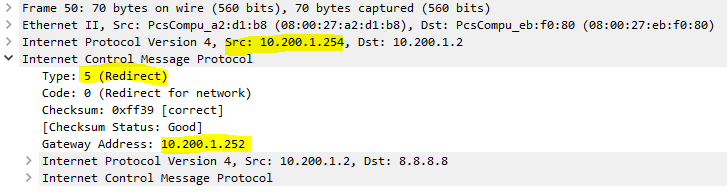
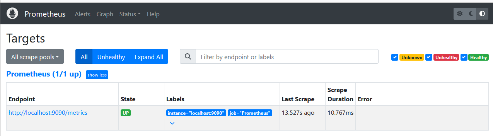
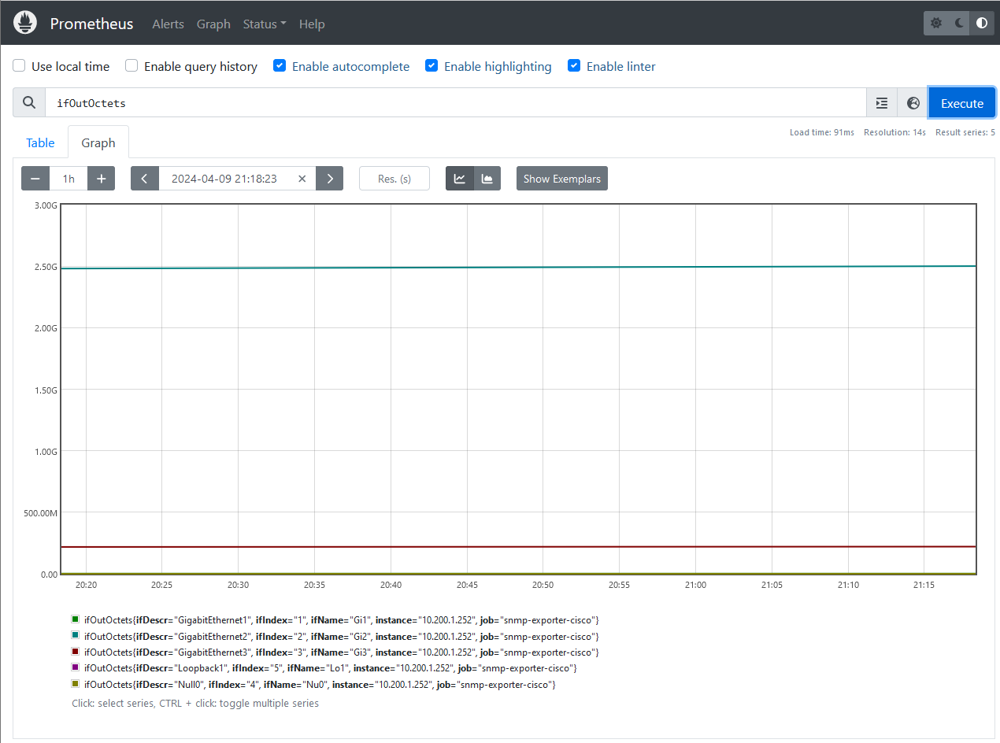
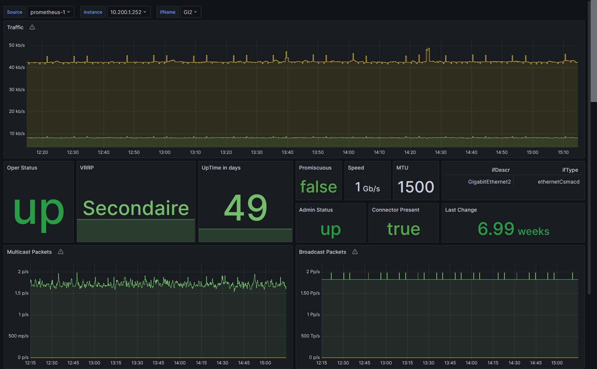
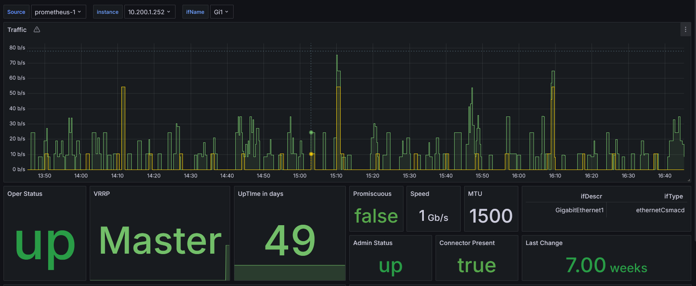

# TP - Mini-Projet supervision

## Table des matières

- [TP - Mini-Projet supervision](#tp---mini-projet-supervision)
  - [Table des matières](#table-des-matières)
  - [Introduction](#introduction)
  - [Partie I : mise en place d'une maquette de réseau local avec haute disponibilité](#partie-i--mise-en-place-dune-maquette-de-réseau-local-avec-haute-disponibilité)
    - [Schéma du réseau :](#schéma-du-réseau-)
    - [Étude théorique préparatoire](#étude-théorique-préparatoire)
      - [Question 1 - Combien de lignes dans la table de routage ?](#question-1---combien-de-lignes-dans-la-table-de-routage-)
        - [Table de routage R1](#table-de-routage-r1)
        - [Table de routage R2](#table-de-routage-r2)
      - [Question 2 - Rôle de VRRP (Virtual Router Redundancy Protocol)](#question-2---rôle-de-vrrp-virtual-router-redundancy-protocol)
      - [Question 3 - Fonctionnement général de VRRP](#question-3---fonctionnement-général-de-vrrp)
      - [Question 4 - Rôle de OSPF dans la topologie](#question-4---rôle-de-ospf-dans-la-topologie)
      - [Question 5 - Tests de fonctionnement](#question-5---tests-de-fonctionnement)
        - [1) Tests de connectivité](#1-tests-de-connectivité)
      - [Question 6 - Tests de fonctionnement avec OSPF](#question-6---tests-de-fonctionnement-avec-ospf)
      - [Question 7 - Configuration de VRRP:](#question-7---configuration-de-vrrp)
      - [Question 8 - Test global du réseau](#question-8---test-global-du-réseau)
      - [Question 9 - Configuration SNMPv3](#question-9---configuration-snmpv3)
      - [Question 10 : Encodage utilisé par SNMP](#question-10--encodage-utilisé-par-snmp)
      - [Question 11 - Analyse de trame SNMPv2](#question-11---analyse-de-trame-snmpv2)
      - [Question 12 - OID branche VRRP](#question-12---oid-branche-vrrp)
      - [Configuration de SNMPv2](#configuration-de-snmpv2)
      - [Question 13 - Pourquoi la première commande échoue alors que la deuxième réussie ?](#question-13---pourquoi-la-première-commande-échoue-alors-que-la-deuxième-réussie-)
      - [Question 14 - OID par rapport à mib-2 de la table vrrpOperTable. Relever dans la vrrpOperTable de R1 et expliquer les 8 premières colonnes et comment est constitué l’index.](#question-14---oid-par-rapport-à-mib-2-de-la-table-vrrpopertable-relever-dans-la-vrrpopertable-de-r1-et-expliquer-les-8-premières-colonnes-et-comment-est-constitué-lindex)
      - [Question 15 - Sur quel firewall appliquer configurer l'exception ?](#question-15---sur-quel-firewall-appliquer-configurer-lexception-)
      - [Question 16 - Protocle de transport pour le test de débit.](#question-16---protocle-de-transport-pour-le-test-de-débit)
      - [Question 17 - Pourquoi les débits calculés sont-ils différents ?](#question-17---pourquoi-les-débits-calculés-sont-ils-différents-)
      - [Question 18 - Les compteurs d’octets sont disponibles en version 32 bits ou en version 64 bits. Justifier précisément quels OID il faut utiliser](#question-18---les-compteurs-doctets-sont-disponibles-en-version-32-bits-ou-en-version-64-bits-justifier-précisément-quels-oid-il-faut-utiliser)
      - [Question 19 - Trouver facilement le débit entrant et sortant grâce à SNMP.](#question-19---trouver-facilement-le-débit-entrant-et-sortant-grâce-à-snmp)
  - [Partie II : Script bash de mesure de débit en SNMP](#partie-ii--script-bash-de-mesure-de-débit-en-snmp)
      - [Question 20 - Pourquoi est-il plus pertinent d’utiliser le cron ou les timers systemd plutôt que la fonction sleep.](#question-20---pourquoi-est-il-plus-pertinent-dutiliser-le-cron-ou-les-timers-systemd-plutôt-que-la-fonction-sleep)
        - [Récupération du compteur d'octets.](#récupération-du-compteur-doctets)
        - [Gestion de la date et stockage dans un fichier.](#gestion-de-la-date-et-stockage-dans-un-fichier)
        - [Lecture de la dernière ligne du fichier, calcul et enregistrement du débit.](#lecture-de-la-dernière-ligne-du-fichier-calcul-et-enregistrement-du-débit)
        - [Gestion du fichier vide et gestion du rebouclage du compteur d’octets.](#gestion-du-fichier-vide-et-gestion-du-rebouclage-du-compteur-doctets)
      - [Question 21 - Expliquer le problème posé par le rebouclage du compteur. Expliquer la solution à mettre en place.](#question-21---expliquer-le-problème-posé-par-le-rebouclage-du-compteur-expliquer-la-solution-à-mettre-en-place)
      - [Question 22 - Relever le code de votre script.](#question-22---relever-le-code-de-votre-script)
      - [Question 23 - Configuration de la tâche cron.](#question-23---configuration-de-la-tâche-cron)
        - [Script générique :](#script-générique-)
  - [Partie III : Projet Prometheus / Grafana / Netflow](#partie-iii--projet-prometheus--grafana--netflow)
    - [Synthèse sur Prometheus et Grafana](#synthèse-sur-prometheus-et-grafana)
    - [Mise en place de la solution :](#mise-en-place-de-la-solution-)
      - [1) Prérequis :](#1-prérequis-)
      - [2) Configuration](#2-configuration)
        - [a) Configuration du conteneur de l'exportateur SNMP](#a-configuration-du-conteneur-de-lexportateur-snmp)
        - [b) Configuration du conteneur Prometheus](#b-configuration-du-conteneur-prometheus)
        - [c) Configuration du conteneur Grafana](#c-configuration-du-conteneur-grafana)
      - [3) Prometheus](#3-prometheus)
      - [4) Grafana](#4-grafana)
    - [Dashboards :](#dashboards-)


## Introduction

Le repository du projet est trouvable en cliquant sur [ce lien](https://github.com/Marc-Harony/23-813-BROISIN-ARAKHSIS)

## Partie I : mise en place d'une maquette de réseau local avec haute disponibilité

### Schéma du réseau :


### Étude théorique préparatoire

<!-- TOC --><a name="partie-i-mise-en-place-dune-maquette-de-réseau-local-avec-haute-disponibilité"></a>

#### Question 1 - Combien de lignes dans la table de routage ?

Théoriquement, 32 routes via car 2 x 16 routes vers les réseau interne de nos collègue (il y a 16 binômes et 2 routeurs/binômes), deux routes directement connectées 10.250.0.0/24 (externe) et 10.200.1.0/24 (interne) et une route pour le management (192.168.170.0/23), soit un total de **35 routes**.

##### Table de routage R1

| Réseau de destination | Prochain saut | Coût |
|-----------------------|:-------------:|-----:|
| 10\.200.1.0/24 | Directement connectée | \* |
| 10\.250.0.0/24 | Directement connectée | \* |
| 192\.168.170.0/23 | Directement connectée | \* |
| 10\.200.2.0/24 | 10\.250.0.103 (R1_Binôme2) | 1 |
| 10\.200.2.0/24 | 10\.250.0.104 (R2_Binôme2) | 1 |
| 0\.0.0.0/0 | 10\.250.0.253 | \* |
| 0\.0.0.0/0 | 10\.250.0.254 | \* |

##### Table de routage R2

| Réseau de destination | Prochain saut | Coût |
|-----------------------|:-------------:|-----:|
| 10\.200.1.0/24 | Directement connectée | \* |
| 10\.250.0.0/24 | Directement connectée | \* |
| 192\.168.170.0/23 | Directement connectée | \* |
| 10\.200.2.0/24 | 10\.250.0.103 (R1_Binôme2) | 1 |
| 10\.200.2.0/24 | 10\.250.0.104 (R2_Binôme2) | 1 |
| 0\.0.0.0/0 | 10\.250.0.253 | \* |
| 0\.0.0.0/0 | 10\.250.0.254 | \* |

Dans ces tables, on a les 3 routes directement connectées, 2 routes récupérées avec OSPF et enfin les 2 routes par défaut.

#### Question 2 - Rôle de VRRP (Virtual Router Redundancy Protocol)

Le protocole de redondance de routeur virtuel, VRRP, est un protocole qui a pour but d'augmenter la haute disponibilité de la passerelle par défaut dans un LAN, de sorte que, lors de la défaillance du routeur principal, un routeur de secours puisse prendre le relais pour router les paquets du LAN vers l'extérieur et ce de manière invisible pour les machines du LAN.

#### Question 3 - Fonctionnement général de VRRP

Voici comment fonctionne le protocole VRRP : 

On dispose de deux ou plusieurs routeurs qui accedent au LAN et aux autres réseaux sur lesquels les paquets du LAN doivent sortir.

On choisit les routeurs que l'on souhaite utiliser pour configurer une passerelle et on les configures avec les parametres suivants : 

- Un numéros de groupe VRID


- Une prioritée codée sur un octet (avec une valeur comprise entre 1 et 254)
- Une adresse IP virtuelle commune pour tous. 

A l'aide de ces informations les routeurs du groupes vont définir une adresse mac virtuelle qui sera egale à **00-00-5E-00-01-{VRID}.**

Les routeurs comuniques entre eux a intervalle regulier via des message multicast sur l'dresse 224.0.0.18 et avec le champs protocole de l'en-tête ip a 0x112.

Ces messages servent a echanger entre eux leurs priorités, le routeur avec la plus hauite priorité passe maitre. En cas d'égalité de deux pritorité, le routeur avec l'adresse ip la plus "grande" (numériquement) passe maitre.

  
Le routeur maitre se présente au réseaux avec l'ip et la mac virtuelle. Les autres routeurs passe en mode backup, ils continues d'envoyer des paquet en multicast mais restent passive niveau routage pour le LAN.

Sur les machines du LAN on parametre la paserelle par défaut avec l'adresse virtuelle. Cette configuration est faite une seule fois (lors de la configuraation DHCP par exemple). Cela permet a ce que le chqgement de maitre soit invisible pour les équipement du LAN. et 

#### Question 4 - Rôle de OSPF dans la topologie

Dans notre cas, grâce au protocole OSPF on s'assure que les deux routeurs R1 et R2 possède les mêmes routes dans leurs table de routage. il faut en effet si l'un des routeurs tombe que l’autre soit en mesure d'acheminer les paquets du LAN vers les mêmes destination que le maitre.

> ##### Vérification I - Faire valider par l’enseignant

#### Question 5 - Tests de fonctionnement

Pour valider la mise en place du réseau a la fin de la mise en place des VMs A et R1, nous allons tester les différents points suivants :

##### 1) Tests de connectivité

Vérifier la connectivité de A vers R1 :

```
A~# ping 10.200.1.251
```

Vérifier la connectivité de A vers R2 :

```
A~# ping 10.200.1.252
```

Vérifier la connectivité de R1 vers R2

```
R1~# ping 10.200.1.252
```

#### Question 6 - Tests de fonctionnement avec OSPF

On vérifie l'état de la table de routage des routeurs.

```
RX~# sh ip route
```

Si la configuration est fonctionnelle, on peut voir des routes avec le code O.

Vérifier que R1 reçoivent bien des routes OSPF:

```
 R1~# show ip route
813-R1(config-router)#do sh ip route
[...]
O*E2  0.0.0.0/0 [110/10] via 10.200.1.252, 00:00:06, GigabitEthernet2
      10.0.0.0/8 is variably subnetted, 18 subnets, 2 masks
O        10.20.3.1/32 [110/3] via 10.200.1.252, 00:00:06, GigabitEthernet2
O        10.20.3.2/32 [110/3] via 10.200.1.252, 00:00:06, GigabitEthernet2
O        10.20.4.2/32 [110/3] via 10.200.1.252, 00:00:06, GigabitEthernet2
O        10.20.5.1/32 [110/3] via 10.200.1.252, 00:00:06, GigabitEthernet2
O        10.20.5.2/32 [110/3] via 10.200.1.252, 00:00:06, GigabitEthernet2
O        10.100.1.0/24 [110/3] via 10.200.1.252, 00:00:06, GigabitEthernet2
O        10.100.3.0/24 [110/3] via 10.200.1.252, 00:00:06, GigabitEthernet2
O        10.100.4.0/24 [110/3] via 10.200.1.252, 00:00:06, GigabitEthernet2
O        10.100.5.0/24 [110/3] via 10.200.1.252, 00:00:06, GigabitEthernet2
C        10.200.1.0/24 is directly connected, GigabitEthernet2
L        10.200.1.251/32 is directly connected, GigabitEthernet2
O        10.200.2.0/24 [110/3] via 10.200.1.252, 00:00:06, GigabitEthernet2
O        10.200.3.0/24 [110/3] via 10.200.1.252, 00:00:06, GigabitEthernet2
O        10.200.4.0/24 [110/3] via 10.200.1.252, 00:00:06, GigabitEthernet2
O        10.200.5.0/24 [110/3] via 10.200.1.252, 00:00:06, GigabitEthernet2
O        10.200.6.0/24 [110/3] via 10.200.1.252, 00:00:06, GigabitEthernet2
C        10.250.0.0/24 is directly connected, GigabitEthernet3
L        10.250.0.101/32 is directly connected, GigabitEthernet3
      172.29.0.0/16 is variably subnetted, 2 subnets, 2 masks
C        172.29.253.0/24 is directly connected, GigabitEthernet1
L        172.29.253.32/32 is directly connected, GigabitEthernet1
      192.0.0.0/32 is subnetted, 1 subnets
C        192.0.0.1 is directly connected, Loopback0
O     192.168.140.0/23 [110/102] via 10.200.1.252, 00:00:06, GigabitEthernet2
O     192.168.176.0/24 [110/102] via 10.200.1.252, 00:00:06, GigabitEthernet2
```

Ici, la table de routage nous montre que R1 a bien reçu les routes des autres routeurs et qu'elles ont été apprises grâce à OSPF.

#### Question 7 - Configuration de VRRP:

```
R1~# interface GigabitEthernet2
R1~# vrrp 1 ip 10.200.1.254
R1~# vrrp 1 priority 110
R1~# exit

R2~# interface GigabitEthernet2
R2~# vrrp 1 ip 10.200.1.254
R2~# vrrp 1 priority 100
R2~# exit
```

Avec une priorité supérieure, R1 devient le routeur Maître et R2 le routeur de Backup.

#### Question 8 - Test global du réseau

Sur PC A réaliser un ping vers google.fr :

- Éteindre le routeur maitre (R1), vérifer le temps de bascule du routeur maitre de R1 vers R2, le ping doit continuer de passer.

  **Résultat :** Après avoir coupé le lien entre R1 et le LAN des machines A et B (10.200.1.0/24) on observe que B prend immédiatement le rôle de maître. Côté PC-A le ping n'est pas interrompu. Lorsque le lien est coupé, on remarque un saut dans les numéros de séquence des pings.
- Allumer R1, vérifier le temps de bascule du routeur maître de R2 vers R1, le ping doit continuer de passer.

  **Résultat :** Le routeur R1 a repris immédiatement le rôle de maitre. De la même manière, le temps de bascule est invisible pour le PC A ; seul est visible un saut dans les numéros de séquence de la même manière que pour le test précédent.
- Éteindre le lien entre le routeur maitre (R1) et le cœur de réseau (10.250.0.0/24), la route doit être redirigé vers le routeur R2.

  **Résultat :** Après une courte période de 1s sans connectivité, la VIP (**10\.200.1.254,** actuellement sur R1 car le routeur à toujours la plus haute priorité) va **redistribué** la route vers R2 (**10\.200.1.252**)

  ```bash
  64 octets de 8.8.8.8 : icmp_seq=10 ttl=114 temps=1036 ms
  64 octets de 8.8.8.8 : icmp_seq=11 ttl=114 temps=12.2 ms
  De 10.200.1.254 icmp_seq=18 Redirect Network(Nouveau sautsuivant : 10.200.1.252)
  64 octets de 8.8.8.8 : icmp_seq=18 ttl=114 temps=12.0 ms
  64 octets de 8.8.8.8 : icmp_seq=19 ttl=114 temps=13.5 ms
  ```



> ##### Vérification II - Faire valider par l’enseignant

#### Question 9 - Configuration SNMPv3

```
Configuration : 
R1~# snmp-server location pm-serv16
R2~# snmp-server location pm-serv14
RX~# snmp-server contact Arakhsis-Broisin

Récupération sysLocation : 
A~# snmpget -v 3 -u snmpuser -l authPriv -a SHA -A auth_pass -x AES -X crypt_pass 10.200.1.251 1.3.6.1.2.1.1.6.0
```
> ##### Vérification III - Faire valider par l’enseignant


#### Question 10 : Encodage utilisé par SNMP

Lors de l'émission de données SNMP, l'encodage utilisé est le BER (Basic Encoding Rules). Cet encodage est utilisé pour encoder les données SNMP en un format binaire qui peut être transmis sur le réseau.


#### Question 11 - Analyse de trame SNMPv2
Nous avons réalisé la capture d'une trame `snmp-get` entre le PC-B et R1.
Il s'agit d'une trame snmp `get-request` qui utilise la version 2 de SNMP et qui demande quelle est la valeur de `system.sysLocation`.
On voit à travers cette échange que la théorie étudiée en cours est valide, car on aperçoit que le `comunity-string` est bien visible en clair ainsi que l'objet de la requête et la réponse.
```
11:21:06.035525 IP 813-B.45730 > 10.200.1.251.snmp:  C="123test123" GetRequest(28)  system.sysLocation.0
        0x0000:  0800 27a2 d1b8 0800 27eb f080 0800 4500  ..'.....'.....E.
        0x0010:  004b 0c9f 4000 4011 1577 0ac8 0102 0ac8  .K..@.@..w......
        0x0020:  01fb b2a2 00a1 0037 18d5 302d 0201 0104  .......7..0-....
        0x0030:  0a31 3233 7465 7374 3132 33a0 1c02 0464  .123test123....d
        0x0040:  4f72 3c02 0100 0201 0030 0e30 0c06 082b  Or<......0.0...+
        0x0050:  0601 0201 0106 0005 00                   .........
11:21:06.037045 IP 10.200.1.251.snmp > 813-B.45730:  C="123test123" GetResponse(37)  system.sysLocation.0="pm-serv16"
        0x0000:  0800 27eb f080 0800 27a2 d1b8 0800 4500  ..'.....'.....E.
        0x0010:  0054 0023 0000 ff11 a2e9 0ac8 01fb 0ac8  .T.#............
        0x0020:  0102 00a1 b2a2 0040 f427 3036 0201 0104  .......@.'06....
        0x0030:  0a31 3233 7465 7374 3132 33a2 2502 0464  .123test123.%..d
        0x0040:  4f72 3c02 0100 0201 0030 1730 1506 082b  Or<......0.0...+
        0x0050:  0601 0201 0106 0004 0970 6d2d 7365 7276  .........pm-serv
        0x0060:  3136                                     16
```

#### Question 12 - OID branche VRRP

`::= { mib-2 68 }`


#### Configuration de SNMPv2
```bash
Configuration de SNMPv2
RX~# snmp-server community 123test123 RO

Test de configuration de SNMPv2
A~# snmpwalk -v 2c -c 123test123 10.200.2.X system
```

#### Question 13 - Pourquoi la première commande échoue alors que la deuxième réussie ?

Par defaut, la MIB VRRP n'est pas intallée. Nous pouvons la trouver dans /usr/share/snmp/mibs/.


#### Question 14 - OID par rapport à mib-2 de la table vrrpOperTable. Relever dans la vrrpOperTable de R1 et expliquer les 8 premières colonnes et comment est constitué l’index.


Dans le fichier `VRRP-MIB`, on trouve :

`vrrpMIB ::= { mib-2 68 }`
`vrrpOperations ::= { vrrpMIB 1 }`
`vrrpOperTable ::= { vrrpOperations 3 }`

On peut donc en déduire son OID : `mib-2.68.1.3`

```
[etudiant@813-B ~]$ snmpwalk -v 2c -c 123test123 10.200.1.252 mib-2.68.1.3
SNMPv2-SMI::mib-2.68.1.3.1.2.2.1 = Hex-STRING: 00 00 5E 00 01 01
SNMPv2-SMI::mib-2.68.1.3.1.3.2.1 = INTEGER: 2
SNMPv2-SMI::mib-2.68.1.3.1.4.2.1 = INTEGER: 1
SNMPv2-SMI::mib-2.68.1.3.1.5.2.1 = INTEGER: 100
SNMPv2-SMI::mib-2.68.1.3.1.6.2.1 = INTEGER: 1
SNMPv2-SMI::mib-2.68.1.3.1.7.2.1 = IpAddress: 10.200.1.251
SNMPv2-SMI::mib-2.68.1.3.1.8.2.1 = IpAddress: 10.200.1.254
SNMPv2-SMI::mib-2.68.1.3.1.9.2.1 = INTEGER: 1
SNMPv2-SMI::mib-2.68.1.3.1.10.2.1 = ""
SNMPv2-SMI::mib-2.68.1.3.1.11.2.1 = INTEGER: 1
SNMPv2-SMI::mib-2.68.1.3.1.12.2.1 = INTEGER: 1
SNMPv2-SMI::mib-2.68.1.3.1.13.2.1 = Timeticks: (1757126) 4:52:51.26
SNMPv2-SMI::mib-2.68.1.3.1.14.2.1 = INTEGER: 1
SNMPv2-SMI::mib-2.68.1.3.1.15.2.1 = INTEGER: 1

```

| Champ | Description | Valeur |
|---|---| :---: |
| vrrpOperVirtualMacAddr | Adresse MAC virtuelle de la VRRP | 00 00 5E 00 01 01|
| vrrpOperState | Etat de la VRRP | 2 |
| vrrpOperAdminState | Etat administratif de la VRRP | 1 |
| vrrpOperPriority | Priorité de la VRRP | 100 |
| vrrpOperIpAddrCount | Nombre d'adresses IP | 1 |
| vrrpOperMasterIpAddr | Adresse IP du `master` | 10.200.1.251 |
| vrrpOperPrimaryIpAddr | Adresse IP primaire | 10.200.1.254 |
| vrrpOperAuthType | Type d'authentification | 1 |

D'après la MIB on a: `INDEX { ifIndex, vrrpOperVrId }`.

L'inex est constitué de l'index de l'interface et de l'ID de la VRRP.

> ##### Vérification IV - Faire valider par l’enseignant


#### Question 15 - Sur quel firewall appliquer configurer l'exception ?

L'exception est configurée sur la machine qui sert de serveur, soit la machine B. On utilise la commande `sudo firewall-cmd --zone=public --add-port=5201/tcp` pour ouvrir le port 5201, port utilisé par iPerf3.


```
[root@813-A etudiant]# iperf3 -c 10.200.1.2
Connecting to host 10.200.1.2, port 5201
[  5] local 10.200.1.1 port 42122 connected to 10.200.1.2 port 5201
[ ID] Interval           Transfer     Bitrate         Retr  Cwnd
[  5]   0.00-1.00   sec   115 MBytes   964 Mbits/sec    0   3.00 MBytes       
[  5]   1.00-2.00   sec   111 MBytes   933 Mbits/sec    0   3.00 MBytes       
[  5]   2.00-3.00   sec   112 MBytes   944 Mbits/sec    0   3.00 MBytes       
[...]    
[  5]   7.00-8.00   sec   111 MBytes   933 Mbits/sec    0   2.35 MBytes       
[  5]   8.00-9.00   sec   112 MBytes   944 Mbits/sec    0   2.52 MBytes       
[  5]   9.00-10.00  sec   111 MBytes   933 Mbits/sec   11   1.32 MBytes       
- - - - - - - - - - - - - - - - - - - - - - - - -
[ ID] Interval           Transfer     Bitrate         Retr
[  5]   0.00-10.00  sec  1.09 GBytes   941 Mbits/sec   21             sender
[  5]   0.00-10.01  sec  1.09 GBytes   938 Mbits/sec                  receiver

iperf Done.
```

#### Question 16 - Protocle de transport pour le test de débit.

Le protocole de transport utilisé par défaut pour les tests de débit avec iperf est le protocole TCP.

#### Question 17 - Pourquoi les débits calculés sont-ils différents ?

Cela s'explique par le fait que Capinfo c

iPerf ne prend en compte que les données utiles transmises (après la couche 3) alors que capinfos prend en compte l'ensemble des données transmises, y compris les en-têtes Ethernet, IP et UDP. Cette différence de calcul explique la différence de débit entre les deux captures.

#### Question 18 - Les compteurs d’octets sont disponibles en version 32 bits ou en version 64 bits. Justifier précisément quels OID il faut utiliser

Il ne faut pas que le compteur reboucle 2 fois entre deux mesures ni occuper de l'espace mémoire inutilement.
Le rebouclage dépend dy débit de l'interface et de la durée entre les deux mesures.
Les routeurs étant relativement récents l'espace mémoire n'est pas réellement un problème.
<br>
*Dans le cas d'un compteur 32 bits :*
Débit interface | Durée max entre deux mesures
|---|---|
|1G| 34 secondes |
|10G| 3,4 secondes |
|100G| 0,34 secondes |

*Dans le cas d'un compteur 64 bits :*
Débit interface | Durée max entre deux mesures
|---|---|
|1G| environ 4600 ans |
|10G| environ 460 ans |
|100G| environ 46 ans |

<br>

Techniquement, on pourrait utiliser des compteurs 32 bits car le débit du lien est de 1G et on envoie des données pendant 25 secondes. Néanmoins, il faut prendre en compte les erreur humaines qui peuvent survenir lors de la mesure. Par soucis de fiabilité et de confort, il est préférable d'utiliser des compteurs 64 bits. (ifHCInOctets, ifHCOutOctets) car elles réduisent le risque de réinitialisation du compteur durant les tests de débit grâce à une capacité de comptage nettement supérieure (2^32 max pour 32bits contre 2^64 max pour 64bits, soit 4 milliards de fois plus élevée), offrant ainsi des mesures plus fiables.

`ifHCInOctets: .1.3.6.1.2.1.31.1.1.1.6`
`ifHCOutOctets: .1.3.6.1.2.1.31.1.1.1.10`

#### Question 19 - Trouver facilement le débit entrant et sortant grâce à SNMP.


1. Sur A, on récupère la valeur du compteur d'octets : 
```bash
snmpwalk -v3  -l authPriv -u snmpuser -a SHA -A auth_pass -x AES -X crypt_pass 10.200.1.251 IF-MIB::ifHCOutOctets.3
IF-MIB::ifHCOutOctets.3 = Counter64: 57796375
```

2. Génération d'un trafic de 500kbit/s depuis la machine A vers la machine B durant 25 secondes : 
```bash
iperf3 --bitrate 500K -u -c 192.168.141.208 -t 25
# On cible l'interface de la machine B qui est connectée sur le VLAN141
```

3. Récupération de la valeur du compteur de R1 après le transit de données depuis la machine A :
```bash
snmpwalk -v3  -l authPriv -u snmpuser -a SHA -A auth_pass -x AES -X crypt_pass 10.200.1.251 IF-MIB::ifHCOutOctets.3
```

Avant la commande iPerf, le compteur valait `59609314` . Après la commande iPerf, le compteur valait `61165454` octets. La différence entre les deux valeurs est de `1556140` octets. Ainsi, on peut calculer un débit valant `1556140 / 25 = 62245 octets/s`, soit environ `497 kbits/s`.

> ##### Vérification V - Faire valider par l’enseignant

## Partie II : Script bash de mesure de débit en SNMP

#### Question 20 - Pourquoi est-il plus pertinent d’utiliser le cron ou les timers systemd plutôt que la fonction sleep.

Utiliser la fonction `sleep` dans un script pour réaliser des tâches périodiques n'est pas une bonne idée car cela consomme des ressources inutilement. En effet, le script doit rester actif en permanence pour pouvoir exécuter la tâche à intervalle régulier. Cela peut être problématique si le script est exécuté sur une machine avec des ressources limitées. De plus, si le script plante, la tâche ne sera pas exécutée. En revanche, en utilisant le cron ou les timers systemd, la tâche sera exécutée même si le script plante. De plus, cela permet de mieux gérer les tâches périodiques et de les planifier à des heures précises.

##### Récupération du compteur d'octets.


##### Gestion de la date et stockage dans un fichier.


##### Lecture de la dernière ligne du fichier, calcul et enregistrement du débit.


> ###### Validation VI - Faire valider par l’enseignant

##### Gestion du fichier vide et gestion du rebouclage du compteur d’octets.


#### Question 21 - Expliquer le problème posé par le rebouclage du compteur. Expliquer la solution à mettre en place.

Si le compteur d'octets revient à zéro après avoir atteint sa limite, cela crée un problème pour le calcul du débit car la valeur actuelle du compteur est alors plus petite que la précédente. Une solution à ce problème est d'ajouter 2^64 à la valeur actuelle du compteur si elle est plus petite que la précédente. Cela assure un calcul correct du débit.

#### Question 22 - Relever le code de votre script.

```bash
oid_out="1.3.6.1.2.1.31.1.1.1.10.3"
agent_ip="10.200.1.251"
community="123test123"
filename="/tmp/count.log"

value=$(snmpwalk -v2c -c "$community" "$agent_ip" "$oid_out" | awk -F' ' '{print $4}')

date=$(date "+%s")
if [ -f "$filename" ]; then
  last_date=$(tail -n 1 "$filename" | awk -F ';' '{print $1}')
  last_value=$(tail -n 1 "$filename" | awk -F ';' '{print $2}')
else
  last_date=0
  last_value=0
fi

if [ "$value" -lt "$last_value" ]; then
  debit=$(((value+18446744073709599999-last_value) / (date - last_date)))
else
  debit=$(((value - last_value) / (date - last_date)))
fi

echo "${date};${value};${debit}" >> "$filename" 
```


#### Question 23 - Configuration de la tâche cron.

|Fonction|Emplacement|Permissions|
|---|---|---|
|Stockage des scripts|`/usr/bin/scripts/`|`drxwr-xr-x`|
|Fichier de stockage des infos|`/tmp/count.log`|`-rw-r--r--`|

La configuration crontab sur l'utilisateur "etudiant" est la suivante :

```bash
crontab -e
* * * * *  bash /usr/bin/scripts/calculate_throughtput_final.sh
```

Les étoiles signifient chaque minutes de chaque heure de chaque jour, etc... L'ip de la machine sur laquelle le script tourne est la machine A

Ci dessous un exemple de traces du remplissage du fichier via la tache cron

```
[etudiant@813-A ~]$ tail -f /tmp/count.log 
1710844201;71602168;41
1710844261;71604608;40
1710844322;71607278;43
1710844381;71609867;43
1710844441;71612237;39
```
> ##### Vérification VII - Faire valider par l’enseignant

##### Script générique :


## Partie III : Projet Prometheus / Grafana / Netflow

### Synthèse sur Prometheus et Grafana
<details>
  <summary>
    Synthèse sur Prometheus
  </summary>

**Introduction**

Prometheus est un outil de surveillance et d'alerte open source, développé à l'origine par SoundCloud. Il est conçu pour gérer de façon fiable de grandes quantités de données en direct, ce qui en a fait une option privilégiée pour surveiller les infrastructures et les applications dans une variété d'organisations, allant des startups aux grandes entreprises. Il s'appuie sur une façon avancée d'organiser les données, permettant de suivre l'évolution de différentes mesures au fil du temps et de les catégoriser avec des étiquettes spécifiques, comme le nom d'une métrique et des informations complémentaires sous forme de paires clé/valeur. Cette méthode offre une souplesse notable dans la façon dont les mesures sont organisées et catégorisées, simplifiant la gestion de données de surveillance qui peuvent être très détaillées et complexes.

**Fonctionnement de Prometheus**

Prometheus collecte les données en utilisant le protocole HTTP. Il extrait (scrape) périodiquement les métriques exposées par les cibles configurées, comme les serveurs d'applications, les bases de données, et les matériels réseau. Les métriques sont alors stockées dans une base de données locale et peuvent être interrogées via le langage de requête PromQL (Prometheus Query Language). PromQL permet aux utilisateurs de sélectionner et d'agréger les données de séries temporelles, offrant ainsi une puissante flexibilité pour l'analyse et la visualisation des métriques. Prometheus propose également des fonctionnalités d'alerte basées sur des règles, qui peuvent déclencher des notifications via divers canaux (email, Slack, etc.) lorsque certaines conditions sont remplies.

**Comparaison avec d'autres solutions de supervision**

Quand on compare Prometheus à d'autres solutions de supervision, telles que Nagios, Zabbix, ou Grafana, plusieurs points clés ressortent :

- Modèle de données: Contrairement à Nagios et Zabbix, qui se concentrent sur la surveillance basée sur l'état et les événements, Prometheus se distingue par son modèle de données basé sur les séries temporelles. Cela lui permet de mieux gérer les métriques à haute granularité et de fournir une analyse plus approfondie sur le comportement des systèmes sur le temps.<br>

- Architecture: Prometheus utilise une architecture sans agent pour la collecte des métriques, ce qui simplifie la configuration et le déploiement par rapport aux solutions nécessitant l'installation d'agents sur les systèmes surveillés. Nagios et Zabbix, par exemple, dépendent fortement des agents pour la collecte de données, ce qui peut augmenter la complexité de la gestion et la maintenance.<br>

- Performance et échelle: Grâce à son efficace modèle de stockage de séries temporelles et à son protocole de collecte léger, Prometheus excelle dans les environnements à grande échelle et haute performance. Les solutions traditionnelles peuvent rencontrer des difficultés pour traiter de grandes volumes de données en temps réel sans dégradation des performances.<br>

- Écosystème et intégrations: Prometheus bénéficie d'un large écosystème et d'une communauté active, offrant une multitude d'exportateurs (exporters) pour divers services et applications. Bien que Nagios jouisse d'une longue histoire et d'une vaste bibliothèque de plugins, Prometheus propose des intégrations plus modernes et faciles à déployer pour les technologies cloud natives.<br>

- Visualisation et alertes: Bien que Prometheus possède des capacités de visualisation et d'alerte, il est souvent couplé avec Grafana pour une expérience de visualisation avancée. Grafana fournit des tableaux de bord dynamiques et interactifs, surpassant les capacités de visualisation native de Prometheus et offrant une meilleure expérience utilisateur par rapport à Zabbix ou Nagios.<br>

**Conclusion**

En conclusion, Prometheus se distingue dans l'écosystème de la surveillance par son modèle de données performant, sa facilité de déploiement, et sa capacité à évoluer pour gérer des infrastructures de grande envergure. Sa conception sans agent, combinée à une large gamme d'intégrations et un puissant langage de requête, en fait une solution de choix pour les environnements modernes, en particulier ceux qui adoptent des pratiques DevOps et cloud native. Comparativement, les solutions traditionnelles comme Nagios et Zabbix peuvent offrir une robustesse dans des environnements moins dynamiques, mais peinent à rivaliser avec la flexibilité et l'évolutivité de Prometheus pour la surveillance des architectures contemporaines.

</details>

<!-- <details> -->
  <summary>
    Mise en place de la solution de monitoring.
  </summary>

Afin de faciliter le dépoiement de la solution de monitoring, nous avons utilisé Docker pour lancer les services Prometheus, Grafana, snmp_exporter. Les fichiers de configuration et les images Docker sont disponibles dans le répertoire `docker` du projet.
<br>

### Mise en place de la solution :


#### 1) Prérequis : 

|Machine|Services|Ports|
|---|---|:-:|
|PC-A|Conteneur hébergeant un seveur WEB|80|
|PC-B|Conteneur hébergeant Grafana|3000|
|PC-B|Conteneur hébergeant Prometheus|9090|
|PC-B|Conteneur hébergeant SNMP Exporter|9116|

On créer un répertoire `~/monitoring` sur le PC-B pour stocker les fichiers de configuration et le fichier `docker-compose.yaml`.

**Arborescence du projet:**
```bash
[etudiant@813-B ~]$ tree
.
└── monitoring                # Répertoire du projet
    ├── docker-compose.yml    # Fichier de configuration Docker
    ├── generator.yml         # Fichier de génération des OID
    ├── grafana               # Répertoire de configuration de Grafana
    │   ├── datasource.yml    # Fichier de configuration de la source de données
    │   └── grafana.ini       # Fichier de configuration de Grafana
    └── prometheus            # Répertoire de configuration de Prometheus
        ├── prometheus.yml    # Fichier de configuration de Prometheus
        └── snmp-exporter     # Répertoire de configuration de SNMP Exporter
            └── snmp.yml      # Fichier de configuration de SNMP Exporter
```


<https://github.com/prometheus/snmp_exporter>

#### 2) Configuration

Pour fonctionner correctement et récupérer des données issues de requêtes SNMP, Prometheus nécessite un exportateur SNMP. Dans notre cas, nous utiliserons `snmp_exporter`

##### a) Configuration du conteneur de l'exportateur SNMP

Le générateur (`generator.yml`) est un fichier dans lequel seront définis les OID SNMP à utiliser dans les requêtes et à exporter vers Prometheus. Ce dernier sera utilisé pour générer le fichier de configuration YAML minimaliste qui sera employé dans notre conteneur `snmp_exporter`.

Le fichier `generator.yml` se trouve dans le répertoire suivant : `~/monitoring/generator/generator.yml`.

Pour générer le fichier de configuration, il faut se placer dans le répertoire `~/monitoring/generator` et exécuter la commande suivante `make generate`.

Cette commande va créer un fichier `snmp.yml`dans le même répertoire. Ce fichier contient les informations nécessaires pour l'exportateur SNMP. Le fichier a été déplacé dans le répertoire `~/monitoring/prometheus/snmp-exporter/snmp.yml`.

Une fois le fichier de configuration généré, il faut créer un fichier `docker-compose.yaml` pour définir les services et les réseaux Docker nécessaires pour notre solution de monitoring. Le fichier `docker-compose.yaml` se trouve dans le répertoire `~/monitoring/docker-compose.yaml`.

##### b) Configuration du conteneur Prometheus

**Configuration des jobs Prometheus**

La récupération des données sur Prometheus est spécifiée dans le fichier `prometheus.yml`. C'est dans ce fichiers que sont définies les cibles à monitorer, les intervalles de requêtes, la ou les communautés à utiliser, etc. mais aussi l'adresse IP de l'exportateur SNMP. Le fichier de configuration est situé dans le répertoire `~/monitoring/prometheus/prometheus.yml`.

**Configuration du conteneur**

   La configuration du conteneur Prometheus dans le fichier [docker-compose.yml](https://github.com/gigallace/24-813-GIAMBI-BUTHAUD/blob/main/projet/docker-compose.yml) et très légère.  
   En effet seuls les volumes et le réseau Docker "monitor" sont a spécifier : 

   ```yaml
    volumes:
      - ./prometheus:/etc/prometheus
    networks:
      - monitor
   ```

Le réseau "monitor" est un réseau Docker de type bridge qui permettra aux conteneurs de communiquer entre eux.

##### c) Configuration du conteneur Grafana

**Configuration de la datasource**

Le fichier `datasource.yml` est créé. Ilm contioent les informations concernant la source de données que Grafana va utiliser, dans notre cas, on renseigne l'url de notre conteneur Prometheus et la méthode de connexion au serveur. Le fichier est situé dans le répertoire `~/monitoring/grafana/datasource.yml`.


1. Configuration du conteneur 

Dans notre fichier [docker-compose.yml](https://github.com/gigallace/24-813-GIAMBI-BUTHAUD/blob/main/projet/docker-compose.yml) créé précédemment, nous ajoutons un conteneur Grafana, nous précisons les identifiants de connexion, les paramètres du service SMTP (que nous utiliserons ultérieurement, "l'import" du fichier de sources "datasource.yml" et les volumes de stockage persistants de la configuration et des données Grafana. 

#### 3) Prometheus

Avant d'interagir avec Grafana, il est nécessaire de vérifier que Promotheus fonctionne correctement et que les jobs configurés sont bien exécutés.


Sur la page `TARGETS` il y a les cibles configurées dans le fichier `prometheus.yml`.



La page `GRAPH` permet de confirmer la remontée des données. En tapant un des OIDs exportés précédemment, il est possible de retrouver les données collectées.



#### 4) Grafana

### Dashboards : 

 Voici la surveillance de R2 avant de faire tomber le liens entre R1 et le LAN :


 Voici la surveillance de R2 après de faire tomber le liens entre R1 et le LAN :



Requête PromQL débit descendant R1 : 

`rate(ifHCInOctets{ifIndex="3", instance="10.200.1.251"}[$__rate_interval]) * 8`

Requête PromQL uptime R1 : 

`sysUpTime{instance="10.200.1.251"}`
</details>
